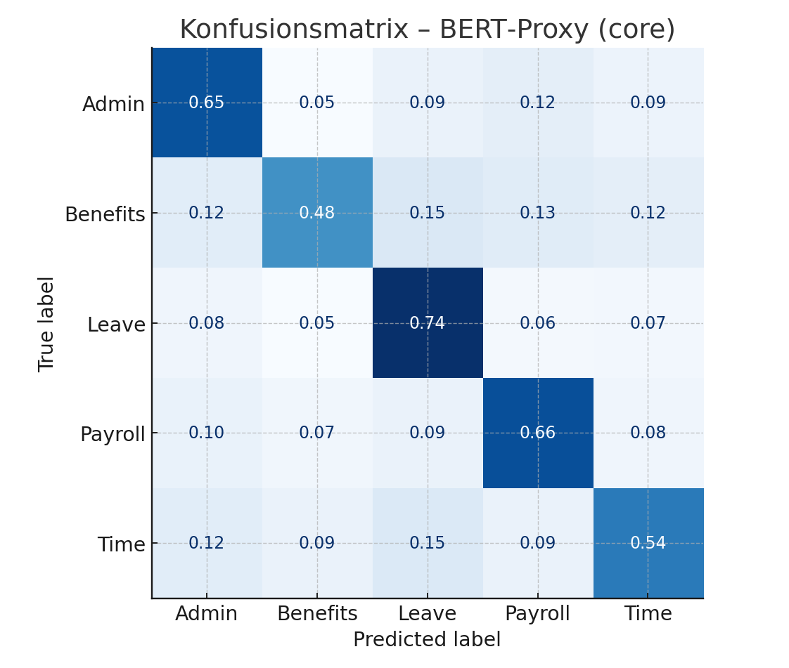
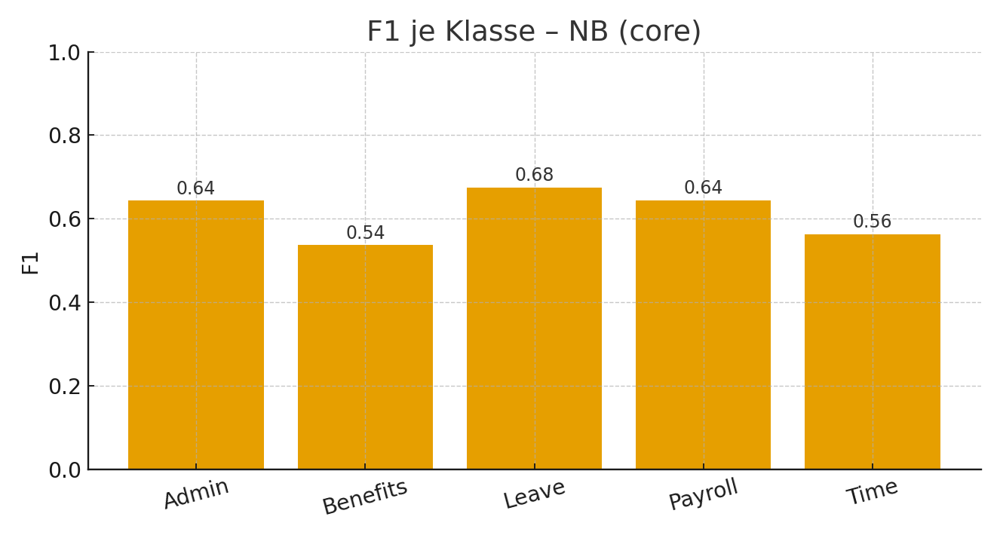
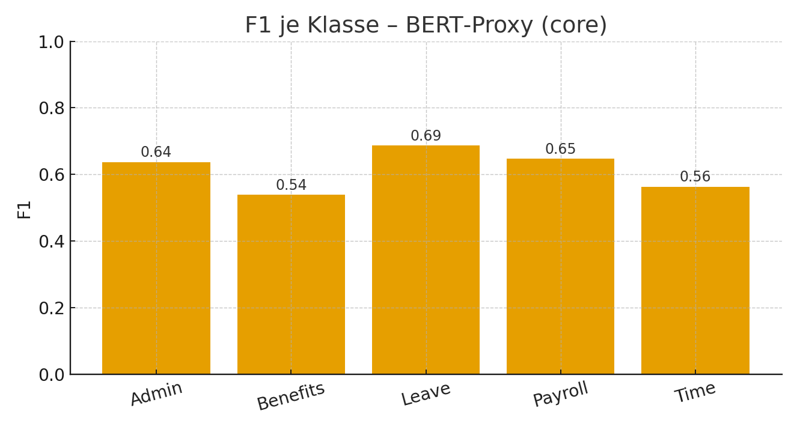
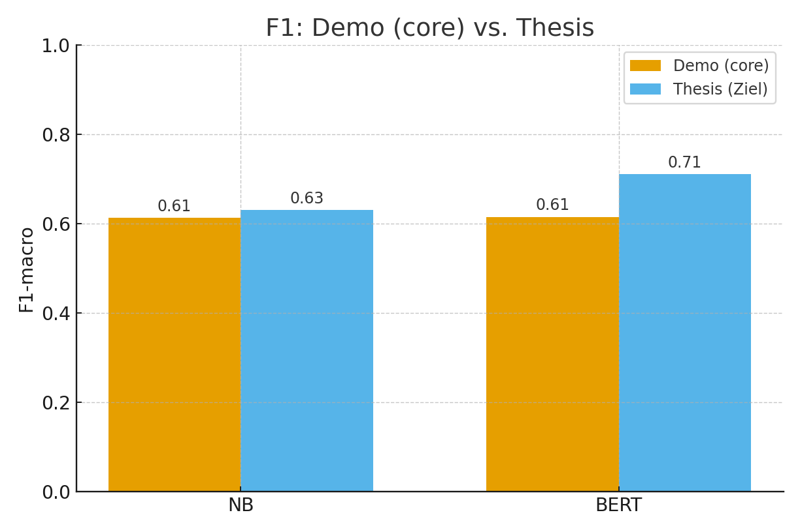
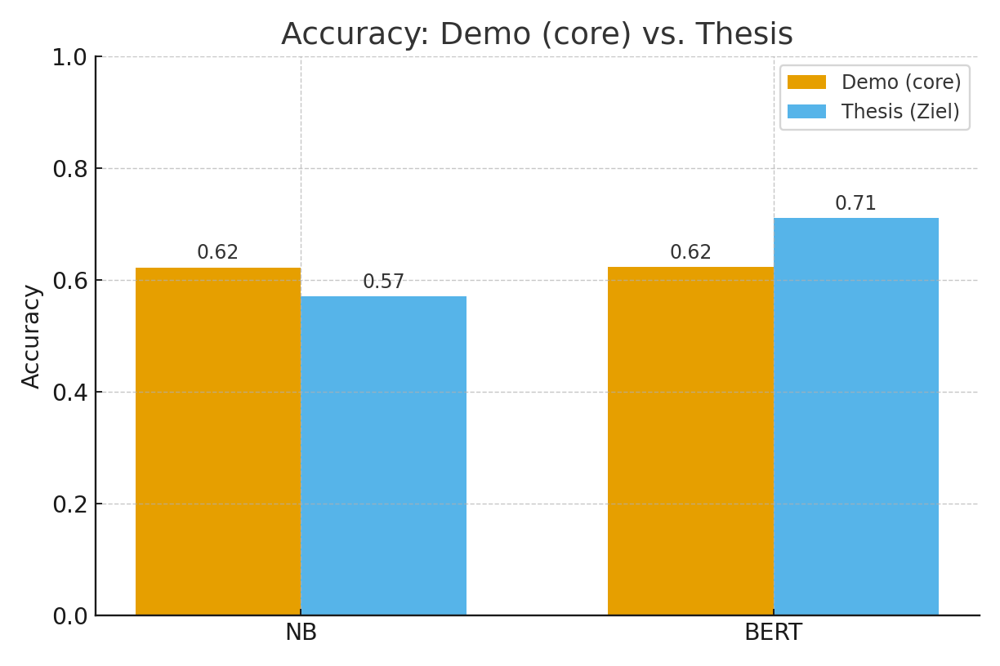

# Ergebnisse (Single Dataset – core)

**Konfusionsmatrizen (normiert):**

 
Der NB-Klassifikator klassifiziert gut für "Leave" und "Payroll", verwechselt jedoch "Admin" oft mit "Leave" oder "Payroll" und hat besonders bei "Benefits" und "Time" hohe Fehlerraten.

 
Der BERT‑Proxy reduziert einige dieser Verwechslungen leicht, insbesondere bei "Leave", aber auch hier bleiben "Benefits" und "Time" die problematischsten Klassen.

**F1 je Klasse:**

 
Die F1-Werte des NB-Modells variieren stark: "Leave" erreicht rund 0.68 und "Payroll" etwa 0.64, während "Benefits" und "Time" mit circa 0.54 und 0.56 deutlich schwächer abschneiden.

 
Der BERT‑Proxy zeigt nur minimale Verbesserungen – leicht höhere F1-Werte für "Leave" und "Payroll", ansonsten ähnliche Schwächen wie NB.

**Overlay vs. Zielwerte der Arbeit:**

 
Im direkten Vergleich zu den Zielwerten der Arbeit verfehlt der NB-Klassifikator das anvisierte F1-Level von 0.63 knapp, der BERT‑Proxy bleibt mit etwa 0.615 jedoch deutlich unter dem BERT-Ziel von 0.71.

 
Bei der Accuracy übertrifft NB mit ca. 0.622 den Zielwert von 0.57, während der BERT‑Proxy trotz ähnlicher Demo-Accuracy weit vom angepeilten Wert 0.71 entfernt ist.

**Zusammenfassung der Kennzahlen:**
Laut `results/metrics_core.json` erzielt NB eine Accuracy von 0.622 und einen F1-macro von 0.613, der BERT‑Proxy kommt auf 0.623 Accuracy und 0.615 F1-macro. Die nahezu identischen Werte deuten darauf hin, dass das komplexere Modell nur einen marginalen Vorteil bringt.
